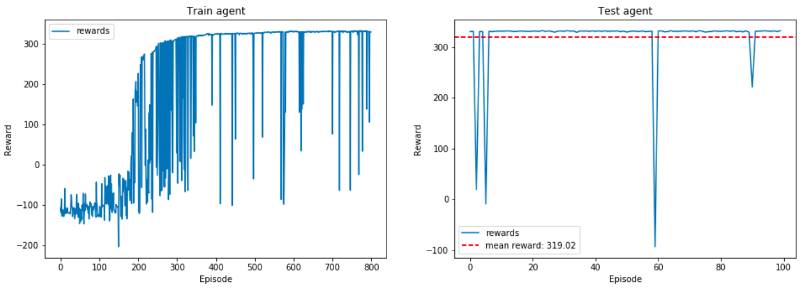

# BipedalWalker-v2
**Environment description**: https://github.com/openai/gym/wiki/BipedalWalker-v2

**Solved Requirements:** average reward of 300 over 100 episodes

**Solved with TD3:** https://arxiv.org/pdf/1802.09477.pdf

# Results:

Average reward for the last 100 episodes > 300 was achieved on 429 episode of training. 
